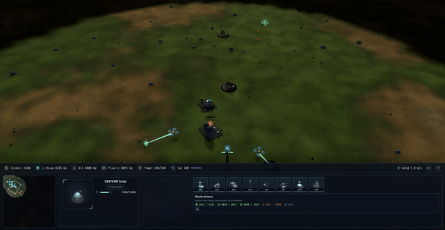

# drone-opticone

**Play it in the browser: <https://hec-ovi.github.io/drone-opticone/>** (static build, nothing to install).




1v1 real-time strategy game with zero humans on the battlefield. Each player is an AI overlord (a CENTCOM base) that mines resources, builds drones from real-world specs, and fights with them. Think Warcraft 2 / StarCraft economy loop plus Command & Conquer satellite recon, but every unit is a real drone modeled 1:1: real weight, battery capacity, wind limits, ballistics, collision behavior.

Core ideas:

- **Real drone database.** Every drone in the game comes from public manufacturer or defense data (DJI Mavic class quads, FPV kamikazes, Switchblade loitering munitions, Shahed-style delta wings, Bayraktar-class fixed wings). No made-up stats.
- **Player-uploaded drones.** Users upload a drone as a GLB model (glTF 2.0, meters, 1:1 scale) plus a printable blueprint (3MF, STL accepted) and a spec sheet. Validated, then sold in the store.
- **Swarm agentic control.** You command groups and policies, not single units. Drones run agent behaviors.
- **Economy.** Lithium for batteries, oil for plastics, a few structures (refinery, mining drones). Fog of war, satellite passes for visibility.
- **Credits.** Simulated blockchain wallet, isolated so a real chain can replace it later. 1v1 matches can escrow a bet.
- **AI presence.** The overlords talk: LLM-driven dialog and TTS voices for your CENTCOM and the enemy AI, isolated behind its own contract with static fallbacks.

## Status

Playable 1 vs AI game, start menu to victory screen. The system is split into 13 isolated contracts in [contracts.md](contracts.md); built so far:

- C-01 registry (`packages/registry`): 8 seed drones from public spec sheets, from a Mavic recon quad up to a jet-powered XQ-58 Valkyrie strike wing, plus validation that rejects physically impossible uploads (10..500 W/kg specific power band).
- C-03 sim core (`packages/sim-core`): deterministic 20 Hz headless tick. Wind above a drone's spec limit makes it drift uncontrolled (the walk mean-reverts to a 6 m/s breeze, capped at 12, so storms are events rather than the weather), batteries drain at the endurance-derived wattage and a dead battery is a crash, kamikazes detonate on proximity, bombers lob ballistic munitions, miners haul lithium and oil and the CENTCOM pays market credits on delivery (2 cr/kg lithium, 1 cr/kg oil), refineries crack oil into plastic, fog of war plus satellite sweeps, centcomm kill wins. C&C-style construction: the CENTCOM places power plants, factories, refineries, relays and uplinks on the field (validated sites, hull rises over the build time), a power grid caps what the base can run (over the cap the factory line freezes, the refinery stops, satellite charge stalls), and each factory builds drones on one sequential assembly line. The market sells stockpiles for credits at posted rates (3/1/4 cr per kg of lithium/oil/plastic, 50 kg lots) and rents out grid surplus as exported power (0.1 cr/s per spare unit, toggleable); both close during a brownout. Storehouses are forward ore drop-offs: miners always deposit at the NEAREST own depot, refinery or CENTCOM, so a storehouse by the far nodes keeps the haul loop short. Missile defense batteries are detectors and interceptors in one: a powered radar that lights up 800 m of fog and an 8-round missile rack that launches visible homing interceptors (220 m/s, proximity fuse, 500 m engagement ring drawn when the battery is selected) at incoming munitions first, hostile airframes second, on a 2.5 s cooldown. The rack auto-reloads one missile per 5 s cycle and each reload bills 4 kg plastic + 40 credits. Structures overall carry doubled hull so bases die to campaigns, not to one lucky pass. Terrain elevation is authoritative: drones hold altitude above ground level, wind-blown drones fly into hillsides, munitions impact on the relief. Group orders fan out over a formation disc, own drones run collision avoidance instead of dying on the spawn pad, enemy midair contact is still fatal for both.
- C-07 agents (`packages/agents`): standing policies (patrol, mine, hunt, kamikaze trigger, return at low battery) that keep working outside control range, and a deterministic overlord AI opponent that builds an economy, keeps a kamikaze guard on every striker, waits out gales, and wins a full match end to end (the test proves it). The overlord also keeps its base alive: it rebuilds a lost factory or refinery, raises a new power plant when its grid browns out, and stands up a missile defense battery once its economy is running.
- C-04 scene (`packages/scene`): three.js r185 WebGPU renderer (WebGL2 fallback). Every airframe is a modeled, animated unit: spinning rotors with blur discs, banking into turns, hover bob, loss-of-control flutter, blob shadows. Structures live too: rotating CENTCOM radar, refinery flare burning, factory crane sliding, uplink dish tracking, pumpjacks nodding, lithium crystals pulsing. Explosions with debris and smoke, mining beams, order markers, floating health bars, satellite sweep radar rings. Terrain with generated texture, scattered rocks and shrubs, sky dome, sun shadows. RTS camera with edge pan, right-drag and grab pan, middle-drag orbit, box select, Shift+1..9 control groups. Units, buildings and resource nodes are all selectable, enemies included (intel only). Anything under 75% hull smokes through four damage states up to open flame. Hover feedback while units are selected: a red ring over targets your selection can attack, a teal ring over nodes your miners can harvest, a not-allowed cursor when nothing selected can act. Standing target rings mark whatever the selection is currently working on (mined node, attack target, move point), and interceptor missiles fly as cyan tracers. Construction placement shows a green/red footprint ghost (right-click or Esc cancels). An offscreen studio rig renders every model once into thumbnails the UI uses everywhere. The client plays 4 sim-seconds per wall second (fixed-timestep accumulator), so the real-spec speeds feel like an RTS instead of a ferry schedule.
- C-05 UI (`packages/ui`): one command console docked at the bottom, every panel its own module. Resource strip with badges and a satellite energy bar, canvas minimap (terrain, fog, units, camera viewport, click or drag to move the camera), a live unit plate showing the rendered model with scanline overlay, name, role tag, an activity-colored frame and status tag (teal MINING, red ATTACKING, amber RETURNING) plus a target line naming what the unit works on, refreshed from every view (hostile plates go red), a per-unit 3x3 order card (only the selected unit type's actions are visible: a miner shows mine/stop/return, a strike quad shows kamikaze guard/hunt, an uplink shows the sweep, buildings show nothing they cannot do) with a cursor-following tooltip; the build info card is sticky, always filled, and never reflows on hover, factory build tiles showing each airframe's rendered model with role-colored frames and a specs strip (shown only while your factory is selected, RTS style; the satellite sweep is likewise an order on the uplink), queue counts as number badges on the tiles with a progress line, a CENTCOM construction panel with structure tiles and power math, a grid power chip that flags LOW POWER. Every resource chip, build tile, cost icon and dependency chip carries a cursor tooltip saying what it is and how to get it (with LOW/SHORT hints); an uncontrolled drone's tag distinguishes STORM DRIFT (wind over its limit) from NO LINK (out of control range), the oil and plastic chips show live -1/s and +0.5/s rates while the refinery cracks, the refinery plate states its pipeline status, and a selected node names its reserve and what it funds. Tiles you cannot afford stay hoverable and say why on their bottom band (NEED PLASTIC); hovering any tile opens an info card: name, a one-line role, every resource as need / have (green covered, red short, live as the bank moves), build time, and dependency-building icons. The minimap is a pure map that fills its panel with no chrome, and the console carries no headings or hint prose. Start menu, victory/defeat screen, field manual.
- C-06 telemetry (`packages/telemetry`): reconnecting WebSocket channel (sequence numbers, rtt pings, batched metrics) plus a tiny room relay server that pairs two clients per match and never reads payloads. The transport behind the upcoming 1v1 mode.
- App shell (`apps/client`): Vite app wiring it all together, plus procedural WebAudio sound effects (explosions, alerts, victory sting; no audio assets) with a mute toggle.

Not built yet: 1v1 wiring on top of C-06, C-02 asset pipeline, C-08..C-12 backend services, C-13 AI dialog and TTS.

## Run it

```
npm install
npm test          # 201 tests: determinism, physics, economy, construction, air defense, UI, e2e AI match
npm run dev       # then open the printed URL, pick a difficulty, Deploy
npm run build     # static bundle, CDN-ready
```

The published build lives on GitHub Pages (no CI): build locally and push the bundle to the `gh-pages` branch:

```
cd apps/client && npx vite build --base=/drone-opticone/
cd dist && touch .nojekyll && git init -b gh-pages && git add -A \
  && git commit -m "Deploy" && git push -f git@github.com:hec-ovi/drone-opticone.git gh-pages && rm -rf .git
```

Controls: left-click selects units, buildings or resource nodes, drag for box select (shift adds), right-click move / attack / mine, right-drag pans (also WASD, arrows, the screen edge, or hold left+right and drag), middle-drag to rotate and tilt, wheel zoom. Shift+1..9 stores a control group, 1..9 recalls it, double tap centers the camera on it. On the minimap: left-click or drag moves the camera (or fires the sweep while armed), right-click sends the selected drones there. Edge pan also works across the console: push the cursor to the physical screen edge (12 px strip) and the map keeps scrolling. Satellite sweep is an order on the selected uplink; construction tiles live on the selected CENTCOM (click a tile, then click the field; right-click or Esc cancels). URL params `?seed=123&difficulty=easy|normal|hard` prefill the menu.

## Stack

- Client: three.js r185 (WebGPU renderer, WebGL2 fallback), TypeScript, Vite, static files servable from a CDN. Fonts bundled via @fontsource, sounds synthesized in WebAudio, so there are no runtime asset fetches.
- Tests: Vitest, Testing Library (jsdom) for UI panels.
- Telemetry and match transport: plain WebSocket, isolated behind its own contract.
- Backend: serverless functions plus a small database for accounts, store, wallet, leaderboard (not started).
